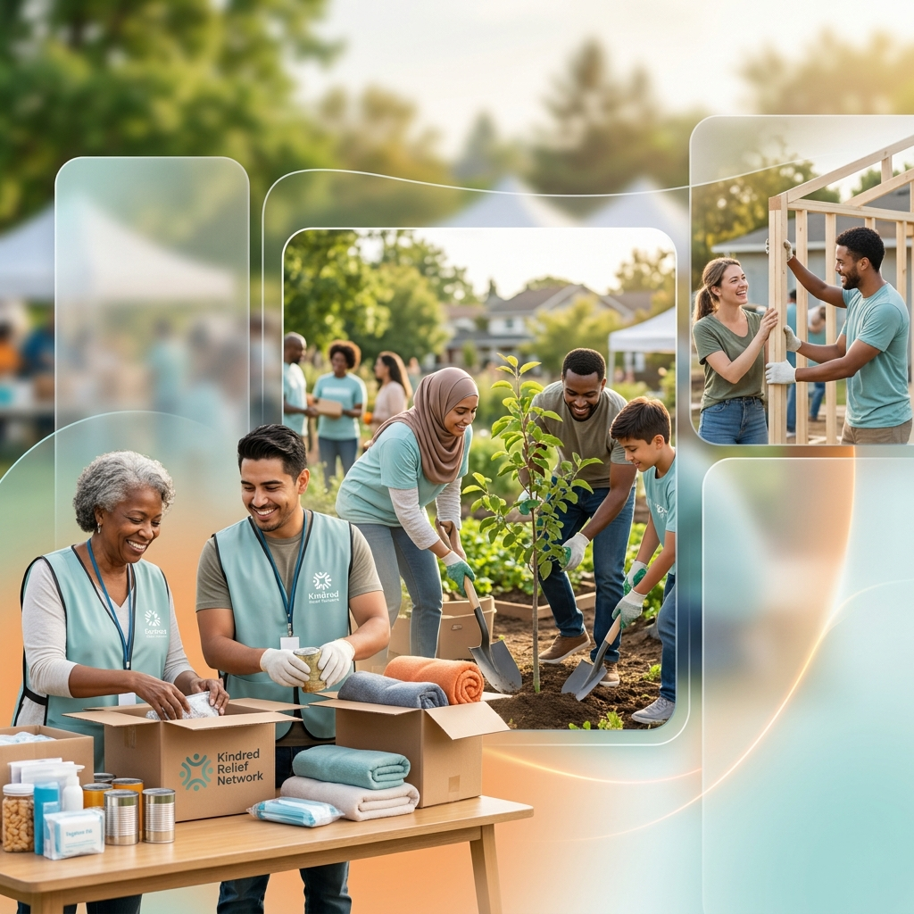

# Kindred Relief Network (KRN) 🤝

**Kindred Relief Network** is a community-driven platform designed to coordinate disaster relief efforts, manage volunteer activities, and facilitate community mutual aid. Built with speed and compassion in mind, KRN empowers local communities to organize quickly during times of need.



## 🌟 Key Features

### 📢 Event & Campaign Management
- **Create Events**: Easily set up relief campaigns with titles, descriptions, and specific needs.
- **Resource Tracking**: Real-time progress bars for both funding goals and volunteer counts.
- **Location-Aware**: Integrated maps showing the proximity of events to the user.

### 💬 Real-Time Coordination
- **Community Chat**: Each event has a dedicated Firestore-backed chatroom for volunteers to coordinate.
- **AI Assistant**: A globally available AI chatbot powered by Google Gemini to help users navigate the platform and provide volunteering guidance.

### 🏆 Gamified Impact
- **Volunteer Leaderboard**: Highlighting "Community Heroes" who have stepped up to support specific causes.
- **Organizer Dashboard**: Tools for organizers to track volunteer check-ins and manage logistics.

### 🔐 Secure & Seamless Access
- **Firebase Auth**: Secure login and registration flows.
- **Social Integration**: Ready for Google and GitHub authentication.

## 🛠 Tech Stack

- **Framework**: [Next.js 15+](https://nextjs.org/) (App Router, Turbopack)
- **Styling**: [Tailwind CSS 4](https://tailwindcss.com/)
- **Backend/Database**: [Firebase](https://firebase.google.com/) (Firestore, Auth)
- **AI Engine**: [Google Generative AI (Gemini 1.5 Flash)](https://ai.google.dev/)
- **Animations**: [Framer Motion](https://www.framer.com/motion/)
- **Mapping**: [Leaflet](https://leafletjs.com/) with OpenStreetMap & Nominatim Geocoding
- **Icons**: [Lucide React](https://lucide.dev/) & Google Material Symbols

## 📁 Project Structure

```text
├── src/
│   ├── app/            # Next.js App Router (Pages & API Routes)
│   │   ├── (app)/      # Authenticated application routes
│   │   ├── (auth)/     # Authentication flows
│   │   └── api/        # Serverless functions (AI Chat)
│   ├── components/     # Reusable UI components
│   ├── context/        # React Context providers (Auth)
│   ├── lib/            # Shared libraries (Firebase config)
│   ├── services/       # Business logic & API calls (Firestore services)
│   ├── types/          # TypeScript definitions
│   └── styles/         # Global CSS and Tailwind configuration
├── public/             # Static assets
└── firebase.json       # Firebase configuration & Security Rules
```

## 🚀 Getting Started

### 1. Clone the repository
```bash
git clone <your-repo-url>
cd Community-Management
```

### 2. Install dependencies
```bash
npm install
```

### 3. Environment Setup
Create a `.env.local` file in the root directory and add your credentials:

```env
# Firebase Configuration
NEXT_PUBLIC_FIREBASE_API_KEY=your_api_key
NEXT_PUBLIC_FIREBASE_AUTH_DOMAIN=your_project.firebaseapp.com
NEXT_PUBLIC_FIREBASE_PROJECT_ID=your_project_id
NEXT_PUBLIC_FIREBASE_STORAGE_BUCKET=your_project.firebasestorage.app
NEXT_PUBLIC_FIREBASE_MESSAGING_SENDER_ID=your_sender_id
NEXT_PUBLIC_FIREBASE_APP_ID=your_app_id

# AI Chatbot
GEMINI_API_KEY_AI_CHAT_BOT=your_gemini_api_key

# Optional: Cloudinary for Image Uploads
NEXT_PUBLIC_CLOUDINARY_CLOUD_NAME=your_cloud_name
NEXT_PUBLIC_CLOUDINARY_UPLOAD_PRESET=your_preset
```

### 4. Run the development server
```bash
npm run dev
```

Open [http://localhost:3000](http://localhost:3000) to see the application in action.

---
Built with ❤️ for community resilience.
