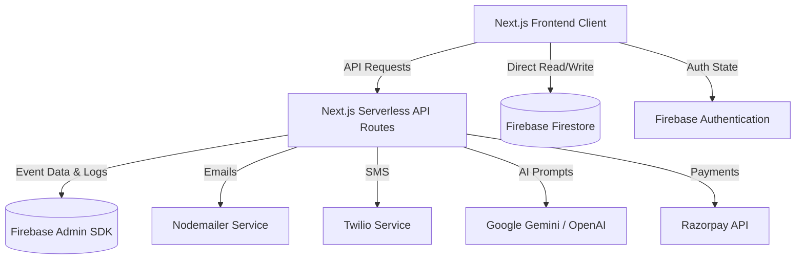
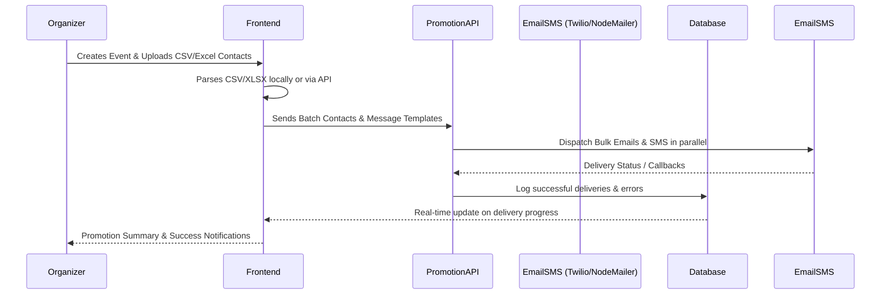

# Kindred Relief Network (KRN) 🤝

[](https://nextjs.org/)
[](https://tailwindcss.com/)
[](https://firebase.google.com/)
[](https://ai.google.dev/)

**Kindred Relief Network** is a comprehensive, professional, community-centric platform engineered to streamline disaster relief, volunteer coordination, and mutual aid. It combines real-time situational awareness with intelligent matchmaking to empower communities when they need it most. Designed with a focus on speed, compassion, and automation, KRN empowers local communities and NGOs to organize efficiently during critical times.

---

## 🚀 Key Innovation Pillars

### 🛡️ Community Sentinel (Live Safety Monitoring)
*   **Real-Time Data**: Integrates live feeds from **USGS** and **NOAA** to track environmental risks.
*   **Situational Map**: Interactive Leaflet-based map with custom hazard overlays (Weather, Earthquakes, etc.).
*   **Proactive Alerts**: Notifies community organizers of nearby critical signals before they escalate.

### 🧠 Intelligent Matchmaking
*   **Skill-Based Recommendations**: Proprietary scoring algorithm that matches volunteers to events based on their unique expertise (Medical, Logistics, Technical, etc.).
*   **Match Clarity**: Dynamic "Why it's a match" insights for every recommended event.
*   **Capacity Handling**: Optimized to show up to 6 high-relevance matches at a glance.

### 📢 Event & Campaign Management
* **Intelligent Event Creation**: Quickly set up relief campaigns or events with titles, descriptions, and specific needs. Features an AI-powered description generator to formulate compelling campaign messages.
* **Interactive Resource Tracking**: Real-time progress tracking for funding goals and volunteer registration.
* **Interactive Mapping**: Integrated geospatial mapping (using Leaflet & OpenStreetMap) displaying real-time proximity of events and "Sentinel" hazard overlays to users.

### 🤖 AI-Native Operations
*   **24/7 AI Guide**: A persistent Gemini-powered assistant to answer platform questions and guide volunteer signups.
*   **Generative Event Tools**: AI-assisted generation for professional event descriptions and promotional imagery.
*   **Smart Skill Matching**: Dynamic banners and feeds that recommend specific volunteering tasks based on user profile skills.

### 💬 Real-Time Coordination & Alerts
* **Sentinel Alert System**: Active tracking and mapping of emergency/relief zones to send immediate, automated visual notifications across the feed and dashboards.
* **Community Chat Rooms**: Dedicated Firestore-backed real-time chat spaces for event volunteers to coordinate effectively.

### 🚀 Automated Bulk Communications
* **Multi-Channel Promos**: Built-in promotion service that supports bulk parsing of `.csv` and `.xlsx` contact files.
* **Email & SMS Automation**: Delivers automated event invitations and updates utilizing **Nodemailer** (Email) and **Twilio** (SMS) simultaneously.
* **Firebase Audit Logs**: Ensures every promotion outcome is reliably logged within Firestore.

### 🔐 Verified Volunteer Ecosystem
*   **Email OTP Verification**: Secure, real-world verification via **Nodemailer** to ensure valid participants.
*   **Digital Tickets**: Automated delivery of confirmation emails containing unique **QR codes** for seamless event check-ins.
*   **Volunteer Leaderboard**: Gamified "Community Heroes" system to recognize top contributors.

### 💳 Donations & Financial Integrations
* **Razorpay Integration**: Secure, seamless in-app donation panel for funding campaigns, complete with order creation and fulfillment endpoints.

---

## 🛠 Technical Excellence

| Category         | Technologies Used                                                                                   |
| ---------------- | --------------------------------------------------------------------------------------------------- |
| **Framework**    | [Next.js 16](https://nextjs.org/) (App Router, Turbopack) & [React 19](https://react.dev/)          |
| **Language**     | TypeScript                                                                                          |
| **Styling**      | [Tailwind CSS 4](https://tailwindcss.com/) & [Framer Motion](https://www.framer.com/motion/)        |
| **Database**     | [Firebase](https://firebase.google.com/) (Firestore, Auth, Admin SDK)                               |
| **AI Engines**   | [Google Generative AI (Gemini 1.5+)](https://ai.google.dev/) & [OpenAI API](https://openai.com/)    |
| **Payments**     | [Razorpay](https://razorpay.com/)                                                                   |
| **Mapping**      | [Leaflet](https://leafletjs.com/) & [React-Leaflet](https://react-leaflet.js.org/)                  |
| **Comms/Parser** | [Twilio](https://twilio.com/), [Nodemailer](https://nodemailer.com/), CSV-Parser, Papaparse, XLSX   |

---

## 🏗 Architecture & Process Flows

### High-Level System Architecture


### Event Creation & Bulk Promotion Flow


---

## 📂 Project Architecture

```text
├── src/
│   ├── app/                # Next.js App Router (Pages, Layouts & APIs)
│   │   ├── (app)/          # Main App Views (Dashboard, Feed, Profile)
│   │   ├── (marketing)/    # Public routes (Landing, Login, Register)
│   │   └── api/            # Serverless Functions (Sentinel, Payments, AI, Promote)
│   ├── components/         # Reusable Premium UI Components (Glassmorphism, Modals, Maps, AI Widgets)
│   ├── context/            # Global State (AuthContext, Theme)
│   ├── lib/                # External library configurations (Firebase, Razorpay, OpenAI)
│   ├── services/           # Backend Logic (EventService, Email, Recommendation, SMS, AI)
│   ├── types/              # TypeScript Interfaces
│   ├── utils/              # Helper functions (Geo-calculations, formatters)
│   └── styles/             # Global CSS & Tailwind Config
├── public/                 # Static Assets & Icons
├── firebase.json           # Firebase Deployment Config
└── tailwind.config.ts      # Tailwind styling definitions
```

---

## ⚙️ Configuration & Setup

### 1. Prerequisites
- Node.js 18+
- Firebase Project
- Google AI (Gemini) API Key
- Razorpay Account (Optional)
- Twilio Account (Optional)

### 2. Environment Variables
Create a `.env` or `.env.local` file in the root directory and add your credentials. Refer to the expected variables below:

```env
# Firebase Configuration
NEXT_PUBLIC_FIREBASE_API_KEY=your_api_key
NEXT_PUBLIC_FIREBASE_AUTH_DOMAIN=your_project.firebaseapp.com
NEXT_PUBLIC_FIREBASE_PROJECT_ID=your_project_id
NEXT_PUBLIC_FIREBASE_STORAGE_BUCKET=your_project.firebasestorage.app
NEXT_PUBLIC_FIREBASE_MESSAGING_SENDER_ID=your_sender_id
NEXT_PUBLIC_FIREBASE_APP_ID=your_app_id

# AI Integrations
GEMINI_API_KEY=your_gemini_api_key
OPENAI_API_KEY=your_openai_api_key
GEMINI_API_KEY_AI_CHAT_BOT=your_gemini_api_key_for_bot

# Communications (Email / SMS)
EMAIL=your-email@gmail.com
EMAIL_PASS=your-google-app-password
TWILIO_SID=your_twilio_sid
TWILIO_AUTH=your_twilio_auth_token
TWILIO_PHONE=your_twilio_phone

# Payments
RAZORPAY_KEY_ID=your_razorpay_key_id
RAZORPAY_KEY_SECRET=your_razorpay_secret
```

### 3. Installation
```bash
# Install dependencies
npm install

# Start development server
npm run dev
```

---

## 🛡 Security & Reliability
- **Firestore Security Rules**: Strict access control for user data and chatrooms.
- **Input Validation**: Server-side checks for all API routes.
- **Error Handling**: Comprehensive logging and user-friendly error boundaries.

---

Built with ❤️ by the Kindred Relief Team to foster community resilience and rapid response.
